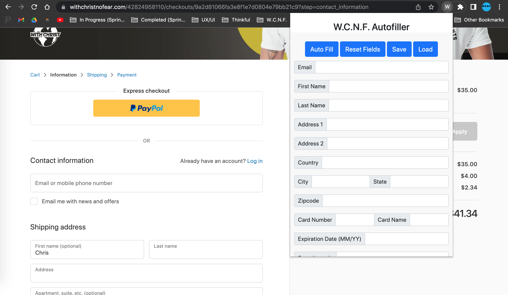

# W.C.N.F. Autofiller

A Chrome extension that fills in the checkout page of [With Christ No Fear](https://www.withchristnofear.com)

## About the Project
This is a Chrome extension that autofills the checkout page for my person website - With Christ No Fear.

## Installation
To use the Chrome extension, please follow the steps below:

1. Download and Unzip code file
2. Install the Chrome browser
3. Go to the address: `chrome://extensions`
4. Enable `Developer mode` (found on the top right of the screen)
5. Click the `Load unpacked` button and select the folder housing the chrome extension
6. The extension should be installed and you can use it!

## How to use Autofiller on website
1. Go to website [With Christ No Fear](https://www.withchristnofear.com)
2. Add a product to your cart
3. When at the checkout page using Google Chrome click the Extensions icon in the top right of your browser Window
4. Click on W.C.N.F. Autofiller, fill in your details and click on 'Auto Fill'
5. Note: If your data doesn't display, click the 'Save' button to save your data then copy the web address for the cart page and open it in a new tab. Now hit the 'Load' button to load all of the previous data you saved and try now clicking the 'Auto Fill' button and your information should load.